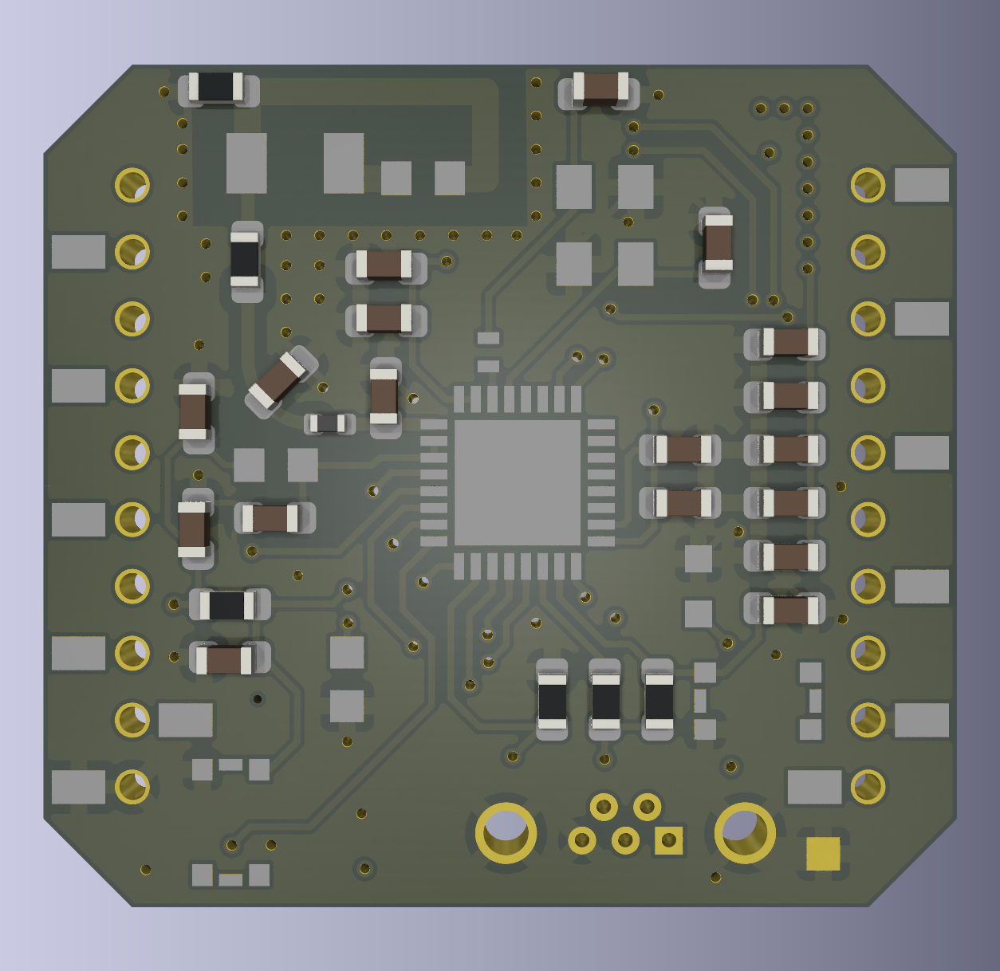
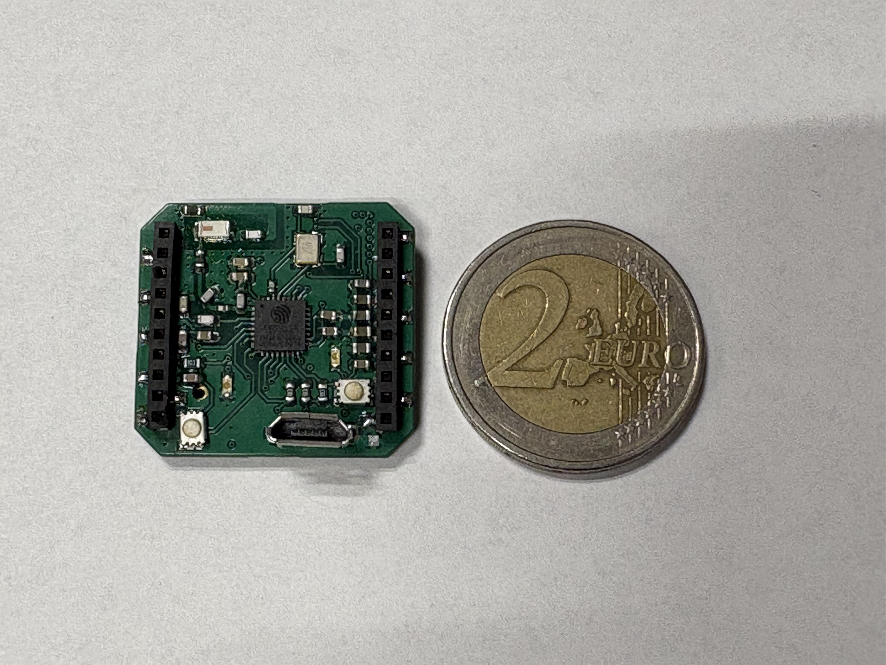

# Hi there, I'm Marco W. Santoro! 🤖

I am a **Robotics Engineer** currently pursuing a Master's degree in **Intelligent and Unmanned Systems** at Poznań University of Technology. My work focuses on the intersection of custom hardware design, real-time embedded systems, and autonomous robotics.

---

### ⚙️ Technical Arsenal

  
  
  
  
  
  
  

* **Hardware Design:** Custom multi-layer PCB development (KiCad), signal integrity, and EMI compliance.
* **Embedded Systems:** Real-time firmware (STM32/ESP32) utilizing **DMA**, hardware interrupts, and **FreeRTOS**.
* **Sensors & Protocols:** MEMS integration (IMUs, I2S Mics) via **SPI/I2S** with low-latency **TCP/IP** streaming.
* **ML/AI & Signal Processing:** Time-frequency analysis (FFT, STFT) and CNN-based autonomous fault detection.

---

### 📊 GitHub Activity

  

---

### 🚀 Engineering Projects

#### **[project-WAVe (B.Sc. Thesis)](https://github.com/Wik19/project-WAVe)**
*A custom wireless vibroacoustic measurement system designed for the **Flapper Nimble+** ornithopter.*

  
  

* **The Hardware:** Engineered a custom 4-layer PCB powered by an **ESP32-C3** to capture high-res 24-bit acoustic (I2S) and 6-DOF inertial (SPI) data.
* **Real-time Pipeline:** Optimized data throughput using **Direct Memory Access (DMA)** and dual-buffering to achieve minimal-latency TCP streaming.
* **Signal Analysis:** Built a Python client for real-time parsing and **STFT** analysis to extract flapping wing frequency signatures and harmonics.

#### **[project-AI-WAVe](https://github.com/Wik19/project-AI-WAVe)**
*End-to-end framework for UAV health monitoring using deep learning.*

* **Deep Learning Pipeline:** Implemented a **2D CNN** that achieved **~97% accuracy** in real-time propulsion system fault detection.
* **Ablation Study:** Demonstrated high model robustness by maintaining **~95% accuracy** even after a **50% reduction** in input spectral features.
* **Acoustic Fingerprinting:** Automated extraction of **MFCCs** to transform raw audio into 2D spectral feature maps.

#### **[project-pup](https://github.com/Wik19/project-pup)**
*Development of a quadruped robot dog, from CAD to NN-driven locomotion.*

  

* **Mechatronics:** Fully custom mechanical design optimized for high weight-to-torque ratios using **CAD** and **3D printing**.
* **Simulation & Autonomy:** Integrating **NVIDIA Isaac Sim** and **ROS** for reinforcement learning-based locomotion training.
* **Roadmap:**
    - [x] CAD design and assembly.
    - [x] Inverse Kinematics calculation and gait patterns.
    - [ ] Implementation in Isaac Sim.
    - [ ] NN-driven joint control.
    - [ ] Partial autonomy.

---

### 🎓 Education

* **B.Eng. in Automatic Control and Robotics** | Poznań University of Technology
* **M.Sc. in Intelligent and Unmanned Systems** | Poznań University of Technology (In Progress)

---

### 📫 Connect with me

  
  

